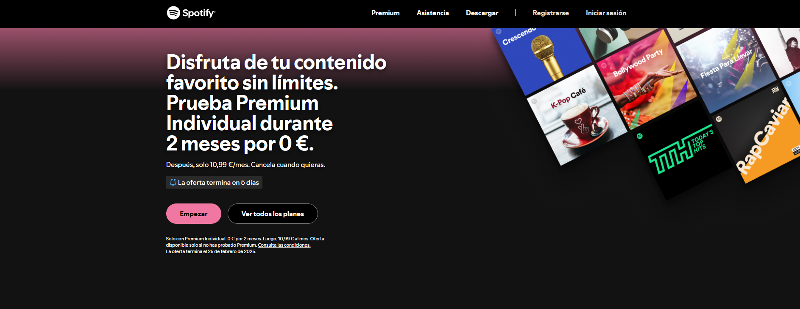

# Clon Visual de Spotify Premium

Proyecto realizado como primer reto para el máster de Nuclio. Se trata de una clonación **visual** (sin funcionalidad) de la página [Spotify Premium](https://www.spotify.com/es/premium/).

## Descripción

El objetivo de este proyecto es replicar el diseño y la estructura visual de la página de Spotify Premium. La implementación se enfoca en el aspecto estético, utilizando HTML y CSS, sin incluir la funcionalidad completa de la página original.

## Estructura del Proyecto

La estructura de carpetas y archivos es la siguiente:
📦 1-LANDING-SPOTIFY-CARLOSDAMOTA/
├── 📂 assets/
│   └── 📂 images/
│       ├── 📄 cards-images.png
│       ├── 📄 desktop-album-evergreen-1x.png
│       ├── 📄 facebook.svg
│       ├── 📄 instagram.svg
│       ├── 📄 mobile-album-evergreen-1x.png
│       ├── 📄 mobile-album-evergreen-2x.png
│       ├── 📄 screenshot_spotify_premium.png
│       ├── 📄 spotify-logo.svg
│       └── 📄 xtwitter.svg
├── 📂 style/
│   ├── 📄 reset.css
│   └── 📄 style.css
├── 📄 index.html
└── 📄 README.md

## Recursos y Enlaces

- **FontAwesome:** Se ha añadido el enlace a la librería para utilizar sus iconos.
- **Google Material Icons:** Se ha incorporado el enlace para utilizar los iconos de Google Material.

> **Nota:** Estos enlaces se han incluido en el `<head>` del archivo `index.html`.

## Actualización Diaria

En esta sección se registrarán los avances diarios del proyecto.

- **Día 1:**  
  - Creación del sistema de archivos y estructura básica de carpetas.
  - Se creó la carpeta `assets/` con las imágenes, incluyendo una captura de pantalla de la página.
  - Se añadió la carpeta `style/` con los archivos `reset.css` (de Erik Meyer) y `style.css`.
  - Se creó el archivo `index.html` con el header, nav y la primera sección.
  - Se incorporaron los enlaces a FontAwesome y Google Material Icons en el `<head>`.

- **Día 2:**
  - Creación del archivo `README.md`.
  - Para evitar problemas en la rama principal, he creado una rama `html`.
  - Finalizada la estructura de HTML usando etiquetado semántico.
  - He aprendido a usar las etiquetas `
` y `
`.
  - Creada la rama `css` para empezar a estilizar.

- **Día 3:**
  - He decidido hacer mobile firs
  - Finalizado header y section hero
  
- **Día 3:**
  - Se han añadido media queries para adaptar el diseño a pantallas grandes, siguiendo un enfoque mobile-first.  
  - Gracias a estas media queries, elementos como el menú de navegación se muestran y organizan correctamente en dispositivos de escritorio.  
 - Se ha iniciado la estilización de la sección de la tabla, mejorando la legibilidad y consistencia visual.  
 - Se corrigió la sección del hero para que la imagen de fondo y el texto mantengan proporciones adecuadas sin colapsar.  
 - Ahora, el bloque de texto (hero-text) se solapa de forma controlada sobre la imagen de fondo.  
 - Se ha aplicado globalmente el `box-sizing: border-box` para integrar padding y bordes en el cálculo de los anchos.  
 - Estos ajustes aseguran un diseño responsive coherente y una experiencia de usuario mejorada en distintos dispositivos.  

- **Día 4**
  - Finalización de la tabla comparativa con efectos hover y optimización responsive
  - Implementación completa de las tarjetas de planes Premium con esquemas de colores distintivos
  - Mejora en la estructura de grid para mostrar 3 columnas en pantallas grandes (>1200px)
  - Ajuste responsive de botones en sección hero para alineación horizontal en pantallas >535px
  - Optimización de comportamiento responsive entre dispositivos móviles y desktop
  - Refinamiento de estilos en elementos interactivos con efectos hover (scale 1.05)

- **Día 5**
 -  Se refinó el gradiente del `body` y se limitó el ancho del contenido con `max-width` para mejorar la legibilidad en pantallas grandes.  
 - Se aumentó el tamaño del título y se ajustaron los botones para mantener la coherencia visual.  
 -  Se mejoró el espaciado y la tipografía de la sección de comparación.  
 - Se implementó un acordeón interactivo con transiciones y estilos responsivos.  
 -  Se añadió un footer flexible con enlaces, redes sociales y una sección legal.  
 - Se mejoraron los efectos `hover` y `active` en botones para una experiencia de usuario más fluida.  

*(Cada día se irán añadiendo nuevas entradas según se vayan implementando cambios.)*

## Cómo Ejecutar el Proyecto

1. Clona el repositorio en tu máquina local.
2. Abre el archivo `index.html` en tu navegador para visualizar la página.

## Capturas

A continuación se muestra una captura de la página original para referencia:

